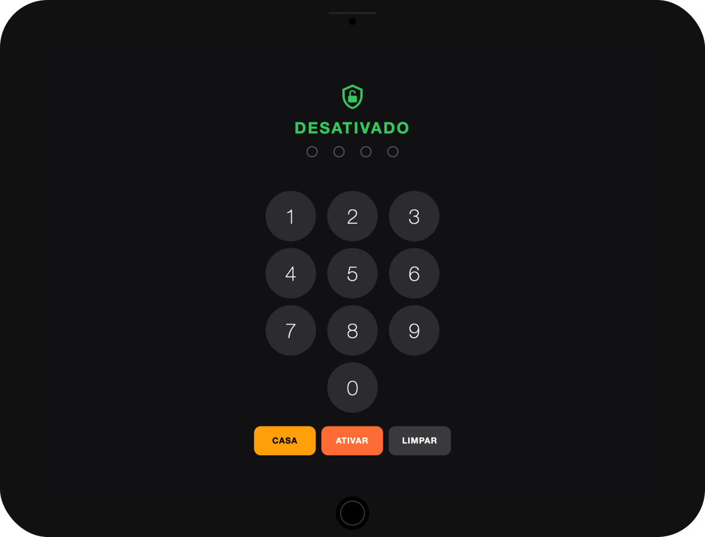

# iPad Mini 1 — Home Assistant Panel with Proximity Wake

Turns an iPad Mini 1 (iOS 9.3.5, Phoenix jailbreak) into a Home Assistant alarm/dashboard panel using TileBoard, with automatic screen activation via a presence sensor.

<p align="center">
  
</p>

## Problem

Fully Kiosk Browser (Android) offers proximity wake natively, but it doesn't exist on iOS. Approaches using direct SSH to wake the screen are unstable on this old hardware.

## Solution

A minimal HTTP server in Python runs directly on the iPad as a daemon. Home Assistant sends simple HTTP requests (`/wake`, `/sleep`) when the presence sensor detects motion. The server executes Activator commands locally — no SSH in the critical path.

```
[Aqara PIR Sensor] → [Home Assistant] → [HTTP GET /wake] → [Python Server on iPad]
                                                                    ↓
                                                          [Activator wakes the screen]
```

## Hardware

| Component | Model | Notes |
|-----------|-------|-------|
| Tablet | Apple iPad Mini 1 (MD531LL/A) | iOS 9.3.5, Phoenix jailbreak |
| Sensor | Aqara Motion Sensor (RTCGQ11LM) | Zigbee, integrated via Zigbee2MQTT |
| Server | Home Assistant | Any installation (HAOS, Docker, Core) |

## iPad Prerequisites

The iPad must be jailbroken with Phoenix and have the following Cydia packages installed:

| Package | Repo | Function |
|---------|------|----------|
| Activator | rpetri.ch/repo | System control via CLI |
| OpenSSH | BigBoss | Remote access for setup |
| Caffeine 2 or Insomnia | BigBoss | Keeps WiFi active with screen off |
| Python | BigBoss | Server runtime (installs Python 2.5) |

To add the Activator repo:
```
Cydia → Sources → Edit → Add → rpetri.ch/repo
```

## Repository Structure

```
├── README.md
├── ipad/
│   ├── server.py                  # HTTP Server (Python 2.5)
│   └── com.panel.server.plist     # LaunchDaemon (auto-start)
└── homeassistant/
    ├── configuration.yaml         # rest_command + input_boolean
    └── automations/
        ├── ipad_wake.yaml         # Wake on presence
        ├── ipad_sleep.yaml        # Sleep on no presence
        └── ipad_reopen.yaml       # Periodically reopen Tileboard
```

---

## Installation

### 1. iPad Setup

#### 1.1 iOS Settings

- **Settings → General → Auto-Lock → Never**
- **Settings → Passcode → Turn Passcode Off** (it's a fixed panel, no need)
- Configure a **static IP** or DHCP reservation on your router

#### 1.2 Change the default SSH password

```bash
ssh root@<IPAD-IP>
# Default password: alpine

passwd root
passwd mobile
```

#### 1.3 Copy the server

```bash
mkdir -p /var/root/panel
```

Copy the contents of `ipad/server.py` to the iPad:
```bash
nano /var/root/panel/server.py
# Paste the file contents and save (Ctrl+O, Enter, Ctrl+X)

chmod +x /var/root/panel/server.py
```

#### 1.4 Edit the Tileboard URL

Open `server.py` and replace `YOUR-HA:8123/tileboard` with your actual Tileboard URL:
```bash
nano /var/root/panel/server.py
# Find the line with YOUR-HA and change it
```

#### 1.5 Test manually

```bash
python /var/root/panel/server.py
```

From another computer on the network:
```bash
curl http://<IPAD-IP>:9090/ping
# Should return: {"status":"alive"}

curl http://<IPAD-IP>:9090/wake
# The iPad screen should turn on

curl http://<IPAD-IP>:9090/sleep
# The iPad screen should turn off
```

Stop the server with `Ctrl+C` after confirming it works.

#### 1.6 Install the LaunchDaemon (auto-start)

Copy the contents of `ipad/com.panel.server.plist`:
```bash
nano /Library/LaunchDaemons/com.panel.server.plist
# Paste the contents and save
```

Load the daemon:
```bash
launchctl load /Library/LaunchDaemons/com.panel.server.plist
```

Confirm it's running:
```bash
curl http://<IPAD-IP>:9090/ping
```

#### 1.7 Set up Tileboard in Kiosk Mode

1. Open Tileboard in Safari
2. **Share → Add to Home Screen** (opens without navigation bar)
3. For full kiosk: **Settings → General → Accessibility → Guided Access → Enable**
4. Open Tileboard and press **Home 3x** to lock into the app

---

### 2. Home Assistant Setup

#### 2.1 configuration.yaml

Add the blocks from `homeassistant/configuration.yaml` to your file. If you already have `rest_command:` or `input_boolean:` sections, add only the content inside them (without duplicating the root key).

Replace `192.168.10.215` with your iPad's IP if different.

Restart Home Assistant after saving.

#### 2.2 Automations

For each file in `homeassistant/automations/`:

1. In HA, go to **Settings → Automations → + Create Automation**
2. Click the **three dots (⋮) → Edit in YAML**
3. Clear the default content
4. Paste the contents of the corresponding file
5. Save

#### 2.3 Test

1. **Developer Tools → Actions → rest_command.ipad_wake** — screen should turn on
2. **rest_command.ipad_sleep** — screen should turn off
3. Walk in front of the Aqara sensor and the screen wakes up automatically

---

## Server Endpoints

| Endpoint | Method | Function |
|----------|--------|----------|
| `/wake` | GET | Wakes the screen (Home button + dismiss lock) |
| `/sleep` | GET | Locks the screen |
| `/ping` | GET | Health check |
| `/open` | GET | Opens the Tileboard URL in Safari |

## Activator Commands (reference)

| Command | Effect |
|---------|--------|
| `activator send libactivator.system.homebutton` | Simulates Home button |
| `activator send libactivator.lockscreen.dismiss` | Unlocks screen |
| `activator send libactivator.lockscreen.show` | Locks screen |
| `activator listeners` | Lists all available commands |

---

## Troubleshooting

### Server not responding

```bash
# Check if it's running
ps aux | grep server.py

# View logs
cat /var/root/panel/server.log

# Restart daemon
launchctl unload /Library/LaunchDaemons/com.panel.server.plist
launchctl load /Library/LaunchDaemons/com.panel.server.plist
```

### WiFi disconnects when screen is off

Confirm that **Insomnia** or **Caffeine 2** is installed and active in Cydia. The iPad should always be connected to the charger.

### iPad rebooted (jailbreak lost)

Phoenix is semi-untethered. After a reboot:
1. Open the **Phoenix** app
2. Tap **Kickstart Jailbreak**
3. Wait for the respring
4. The LaunchDaemon restarts the server automatically

### Aqara sensor with long cooldown

The Aqara PIR sensor has a ~60 second cooldown after detection. This is normal and actually helps in practice — it prevents the screen from flickering on and off. The 2-minute delay in the sleep automation provides a comfortable margin.

---

## Security

The HTTP server has no authentication. Make sure that:
- The iPad is on a secure network (ideally an IoT VLAN)
- Firewall blocks external access to port 9090
- WiFi password is strong
- SSH password has been changed (don't use `alpine`)

## License

MIT
